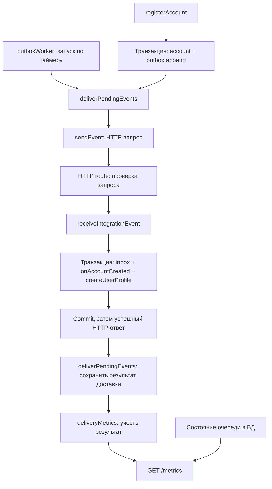

# План стандартизации integration events, use cases и репозиториев

Статус: план, реализация не выполнена.

## Цель

Новое событие добавляется по понятному шаблону, а правила доставки, транзакций и
работы с БД уже заданы инфраструктурой.

План охватывает `integration-events` в обоих сервисах, use cases в
`user-service`, соглашения для репозиториев доступа к БД и назначение,
устройство и переиспользование publisher и metrics в `auth-service`.

## Текущее состояние

Основа уже есть: регистрация записывает account и outbox в одной транзакции,
consumer объединяет inbox и создание профиля. Дальше нужно закрепить границы
ответственности.

| Компонент | Для чего нужен | Что переиспользуется |
|---|---|---|
| Создание события | Описывает произошедший бизнес-факт, например создание account | Формат общий; содержание принадлежит конкретному домену |
| Outbox publisher | Фоном забирает сохранённые события, доставляет их, управляет повторами и DLQ | Алгоритм общий для сервисов с outbox |
| HTTP transport | Отправляет событие конкретному получателю | Реализация общая; URL, credentials и маршрутизация задаются сервисом |
| Outbox metrics | Показывает накопление очереди, ошибки и задержки доставки | Набор технических измерений общий; экземпляры и значения принадлежат сервису |

Сейчас эти компоненты реализованы внутри `auth-service`. Publisher потенциально
переиспользуемый, но импортирует auth-контракты; metrics жёстко используют
префикс `auth_`. Это точки для разделения.

## Основные требования к новой структуре

- Функции и фабрики функций вместо собственных `class` для worker, metrics,
  обработчиков, use cases и репозиториев.
- По расположению и имени файла понятно, что он делает: отправляет, принимает,
  выполняет бизнес-сценарий, работает с БД или измеряет результат.
- `integration-events` разделён на исходящую и входящую обработку.
- `use-cases` находятся внутри своего бизнес-модуля и содержат его сценарии.

## Явные роли компонентов

В таблице используются целевые имена функций и объектов, которые возвращают
фабрики. Сейчас эти роли частично объединены в publisher и dispatcher.

| Компонент | Простое определение | Ответственность |
|---|---|---|
| `createAccountCreatedEvent` | Создаёт событие | Собирает сообщение о произошедшем бизнес-факте |
| `outbox.append` | Сохраняет для отправки | Записывает событие в БД в транзакции бизнес-сценария |
| `outboxWorker.start/stop` | Запускает и останавливает фоновые циклы | Управляет таймером и завершением текущего цикла |
| `deliverPendingEvents` | Организует доставку | Резервирует события, вызывает отправку, фиксирует результат, назначает retry или DLQ |
| `sendEvent` | Отправляет по HTTP | Выполняет один запрос и возвращает результат либо ошибку транспорта |
| `integration-events.routes` | Принимает HTTP-запрос | Проверяет credentials и схему, вызывает приём события, формирует HTTP-ответ |
| `receiveIntegrationEvent` | Обеспечивает однократное применение | В одной транзакции проверяет inbox и вызывает зарегистрированный обработчик |
| `onAccountCreated` | Связывает событие со сценарием | Преобразует payload в input профильного use case |
| `createUserProfile` | Выполняет бизнес-сценарий | Создаёт профиль по правилам модуля `user-profile` |
| `userProfileRepository` | Читает и меняет данные | Выполняет операции хранения профиля |
| `deliveryMetrics` | Учитывает результаты доставки | Записывает количество попыток, их исходы и длительность |
| `metrics.routes` | Отдаёт измерения | Возвращает состояние счётчиков и очереди в формате Prometheus |

Однократное применение на принимающей стороне обеспечивается inbox и
транзакцией для изменений в своей БД. Сама доставка допускает повторы; внешние
побочные эффекты требуют отдельной идемпотентности или собственного outbox.

## Как проходит одно событие



Регистрация завершается после своей транзакции. Фоновая отправка выполняется
отдельно. При повторной доставке inbox пропускает выполнение обработчика и
consumer возвращает успешный ответ. При ошибке обработчика транзакция
откатывается, поэтому следующая доставка может повторить обработку.

## Целевая структура папок

Ниже показаны относящиеся к плану файлы. Названия обозначают целевую структуру,
а не уже выполненный перенос.

```text
packages/integration-event-contracts/src/
├── event-envelope.ts
└── auth/
    └── account-created.v1.ts          # Схема и выведенный из неё тип

services/auth-service/src/
├── modules/
│   ├── auth/
│   │   ├── auth.module.ts
│   │   ├── http/                     # Routes и HTTP-схемы auth
│   │   ├── use-cases/
│   │   │   └── register-account.ts
│   │   ├── events/
│   │   │   └── create-account-created.event.ts
│   │   ├── entities/
│   │   └── repo/
│   │       ├── auth.repository.ts    # Интерфейс
│   │       ├── postgres-auth.repository.ts
│   │       └── auth.mapper.ts        # DB row и преобразование в entity
│   └── integration-events/
│       ├── integration-events.module.ts
│       └── outgoing/
│           ├── outbox.worker.ts
│           ├── deliver-pending-events.ts
│           ├── retry-policy.ts
│           ├── http/
│           │   └── send-event.http.ts
│           ├── repo/
│           │   ├── outbox.repository.ts
│           │   └── postgres-outbox.repository.ts
│           └── metrics/
│               └── delivery.metrics.ts
└── shared/
    ├── database/                     # SQL client и реализация Unit of Work
    └── metrics/
        ├── prometheus.registry.ts
        └── metrics.routes.ts

services/user-service/src/
├── modules/
│   ├── integration-events/
│   │   ├── integration-events.module.ts
│   │   └── incoming/
│   │       ├── receive-integration-event.ts
│   │       ├── handler-registry.ts
│   │       ├── http/
│   │       │   └── integration-events.routes.ts
│   │       └── repo/
│   │           ├── inbox.repository.ts
│   │           └── postgres-inbox.repository.ts
│   └── user-profile/
│       ├── user-profile.module.ts
│       ├── http/                     # Routes и HTTP-схемы профиля
│       ├── use-cases/
│       │   ├── create-user-profile.ts
│       │   ├── get-my-profile.ts
│       │   └── update-my-profile.ts
│       ├── events/
│       │   └── on-account-created.ts
│       ├── entities/
│       └── repo/
│           ├── user-profile.repository.ts
│           ├── postgres-user-profile.repository.ts
│           └── user-profile.mapper.ts
└── shared/
    └── database/                     # SQL client и реализация Unit of Work
```

`outgoing` появляется в сервисе, который отправляет события; `incoming` — в
сервисе, который их принимает. При появлении обеих ролей сервис получает обе
папки. Пустые папки заранее не создавать.

`user-profile/events/on-account-created.ts` принадлежит профилю, потому что
определяет его реакцию на событие. `incoming` получает реестр обработчиков при
сборке зависимостей. Конкретные обработчики подключаются через бизнес-модуль и
composition root приложения; технический приём событий не импортирует
профильные use cases напрямую.

`integration-events.module.ts` собирает компоненты доставки или приёма.
`container.ts` создаёт общую инфраструктуру, а `server.ts` запускает и
останавливает worker. Каждый `*.module.ts` явно экспортирует свои возможности:
например, HTTP routes и фабрику обработчиков событий.

## Функциональный стиль

Соглашение для новых и изменяемых компонентов:

- `createX(deps)` собирает компонент и возвращает функцию либо объект функций.
- Рабочие функции называются действием: `sendEvent`, `receiveIntegrationEvent`,
  `deliverPendingEvents`, `getMyProfile`.
- Зависимости передаются аргументами фабрики и описываются через `type` или
  `interface`.
- Таймер, состояние worker и счётчики хранятся в замыкании конкретного
  экземпляра. Состояние не становится глобальным при замене `class`.
- `createOutboxWorker(deps)` возвращает `{ start, stop }`;
  `createDeliverPendingEvents(deps)` возвращает функцию одного цикла.
- `createDeliveryMetrics(registry)` возвращает функции записи измерений.
- Собственные `class` не использовать для перечисленных компонентов. Внешние
  библиотеки могут предоставлять свой API с конструкторами.

Пример формы use case:

```ts
type GetMyProfileInput = { userId: string }

type GetMyProfileDeps = {
  userProfiles: Pick<UserProfileRepository, 'findById'>
}

export const createGetMyProfileUseCase = ({ userProfiles }: GetMyProfileDeps) =>
  async ({ userId }: GetMyProfileInput): Promise<UserProfile> => {
    const profile = await userProfiles.findById(userId)
    if (!profile) throw profileNotFound(userId)
    return profile
  }
```

Это пример соглашения, а не готовый файл: `profileNotFound` обозначает фабрику
ошибки приложения со стабильным кодом. HTTP-слой сопоставляет этот код статусу
ответа. При замене существующей иерархии ошибок сохранить их коды и проверить
места, использующие `instanceof`; такую миграцию выполнять отдельным шагом.

## 1. Стандартизировать контракты событий и их добавление

Сейчас контракт описан отдельно в
[auth-service](../../services/auth-service/src/modules/integration-events/events.ts)
и
[user-service](../../services/user-service/src/modules/integration-events/events.ts).
В [документации разделения сервисов](user-service-separation.md) это намеренное
решение, поэтому его изменение нужно явно зафиксировать.

Для этого monorepo предлагается отдельный версионируемый пакет контрактов:
runtime-схемы, выведенные из них TypeScript-типы и примеры payload. Сервисы
подключают зафиксированную версию пакета; в пакет входят только контракты. Его
подключение нужно учесть в сборках Docker.

Задачи:

- Закрепить текущий envelope: `eventId`, `type`, `occurredAt`, `data`.
- Принять соглашение об именовании `<domain>.<fact>.vN`.
- Определить владельца каждого события.
- Создавать `eventId` один раз и сохранять его при retry и replay.
- Определить совместимость версий. Сейчас consumer использует
  `additionalProperties: false`, поэтому даже добавление необязательного поля
  может нарушить совместимость.
- Сначала добавлять поддержку новой версии в consumer, затем начинать её
  отправку из producer.

Результат: добавление события состоит из контракта, фабрики, обработчика,
регистрации и проверок совместимости.

## 2. Сделать понятный стандарт use case в user-service

В
[ProcessIntegrationEventUseCase](../../services/user-service/src/modules/integration-events/process-integration-event.ts)
сейчас совмещены выбор обработчика, дедупликация и создание профиля.

Разделить обязанности:

- HTTP route проверяет запрос и преобразует результат в HTTP-ответ.
- `receiveIntegrationEvent` управляет inbox и транзакцией.
- Типизированный реестр выбирает обработчик по `event.type`.
- Обработчик преобразует событие во вход профильного use case.
- `createUserProfile`, собранный фабрикой use case, выполняет профильный сценарий.

Критичная граница: `receiveIntegrationEvent` передаёт обработчику репозитории той же
транзакции. Ошибка создания профиля должна откатывать запись inbox;
подтверждение доставки возвращается после commit.

Обработчик получает репозитории текущей транзакции и собирает с ними
`createUserProfile`. В этом пути use case не открывает вложенную транзакцию и
не использует репозиторий, заранее созданный от общего SQL client.

Для остальных use cases закрепить `Deps`, собственный `Input`, явный результат
и ошибки приложения. Например, вход `UpdateMyProfile` сейчас определяется в
repository-файле — его стоит перенести к прикладному сценарию.

Для папки `use-cases` закрепить следующие правила:

- Единое имя папки — `use-cases`; не смешивать `usecase`, `usecases` и
  `use-cases` в разных модулях.
- Один файл — один бизнес-сценарий: получение профиля, изменение профиля,
  регистрация account.
- Input и результат принадлежат прикладному сценарию; HTTP-схемы остаются в
  `http`, SQL и DB row — в `repo`.
- Проверка формы HTTP-запроса выполняется на входе; бизнес-правила выполняются
  в use case или вызываемых им доменных функциях.
- Use case получает минимальные зависимости. HTTP Request, env и создание
  repository внутри use case не используются.
- Простой сценарий может быть короткой функцией. Дополнительные промежуточные
  сервисы для него не обязательны.
- `deliverPendingEvents` и `receiveIntegrationEvent` остаются техническими
  операциями в `outgoing` и `incoming`; папки бизнес-сценариев ими не заполняются.

Результат: новый обработчик добавляется в реестр без изменения алгоритма
inbox; пропущенный обработчик обнаруживается проверкой типов.

## 3. Систематизировать репозитории и транзакции

Разделить интерфейс репозитория и PostgreSQL-реализацию. Типы строк БД и
преобразования `row → entity` держать рядом с SQL: сейчас `UserProfileRow`
находится в файле сущности.

Зафиксировать единые соглашения:

- `find…` возвращает сущность или `null`.
- Создание возвращает созданную сущность либо явно определённый результат.
- Для условных изменений документируется значение `boolean`.
- Для PATCH различаются отсутствие поля и `null`.
- Ошибки ограничений БД преобразуются в известные ошибки приложения.
- Несколько связанных изменений выполняются через Unit of Work.

Use case получает интерфейс репозитория или Unit of Work; создание
SQL-реализаций выполняется при сборке зависимостей. Это правило стоит
распространить и на существующий
[LogoutAllUseCase](../../services/auth-service/src/modules/session/use-cases/logout-all.ts),
который сейчас сам создаёт repository из `sql`.

Outbox-интерфейс разделить по потребителям: use case регистрации нужен только
`append`; `deliverPendingEvents` нужны резервирование и изменение состояния
доставки; сборщику метрик нужно чтение статистики. Эти небольшие интерфейсы
можно объявить в одном `outbox.repository.ts` и реализовать одной PostgreSQL-фабрикой.

Результат: по интерфейсу понятны поведение метода, ошибки и требования к
транзакции.

## 4. Выделить механизм доставки и исправить гонки publisher

В
[outbox.publisher.ts](../../services/auth-service/src/modules/integration-events/outbox.publisher.ts)
разделить существующий publisher на три компонента:

| Файл | Фабрика | Результат фабрики |
|---|---|---|
| `outgoing/outbox.worker.ts` | `createOutboxWorker` | `start/stop`: периодически вызвать цикл и дождаться его завершения при остановке |
| `outgoing/deliver-pending-events.ts` | `createDeliverPendingEvents` | `deliverPendingEvents`: выполнить один цикл резервирования и доставки |
| `outgoing/http/send-event.http.ts` | `createHttpEventSender` | `sendEvent`: отправить одно событие HTTP-запросом |

Это явная замена нынешних `OutboxPublisher.start/stop`, `runOnce` и
`HttpEventDeliveryTransport`. `publisher` можно использовать как общее название
механизма отправки в документации; в коде роли разделены по действиям.

Worker получает функцию цикла и параметры запуска. Цикл получает интерфейсы
хранилища, отправки и измерений. HTTP sender получает URL, credentials и timeout.
Правила следующей попытки находятся в `retry-policy.ts`.

Здесь есть конкретный риск: текущая policy резервирует 50 событий на 30 секунд,
а последовательная отправка с таймаутом 3 секунды может занять около
150 секунд. При нескольких worker lease может истечь до обработки пакета.

Задачи:

- Предусмотреть резервирование по доступной ёмкости обработки и идентификатор
  владельца lease.
- Разрешить изменять состояние события только worker с актуальным lease;
  устаревший worker не должен перезаписывать результат нового.
- Определить классификацию ошибок, retry с jitter, поведение неизвестных
  версий, shutdown и replay из DLQ.
- Документировать повторную доставку и отсутствие гарантированного порядка
  событий.
- Запретить перекрывающиеся циклы одного worker; сделать повторный `start`
  безопасным, а `stop` — ожидающим завершения текущего цикла.
- Отделить ошибку HTTP-отправки от ошибки сохранения её результата в outbox.
  При успешной доставке и сбое записи подтверждения возможна повторная отправка.
- Учитывать изменение состояния очереди только после успешной записи с
  актуальным lease. Сбой записи метрик не должен менять решение о retry/DLQ.

Общий алгоритм подготовить к переиспользованию через интерфейсы. Выделение
общей библиотеки доставки привязать к появлению второго сервиса, которому
нужен publisher.

Результат: по файлам ясно, кто запускает цикл, кто управляет доставкой и кто
выполняет сетевой запрос. Механизм защищён от устаревшего worker, а настройки
конкретного сервиса задаются при сборке.

## 5. Сделать metrics понятными и полезными

[OutboxMetrics](../../services/auth-service/src/modules/integration-events/outbox.metrics.ts)
сейчас объединяет накопление измерений и генерацию Prometheus-текста.

Metrics отвечают на вопрос «как работает доставка». Решение о retry/DLQ
принадлежит циклу доставки, данные о состоянии событий — outbox repository.

Разделить измерение и экспорт:

| Файл | Что делает |
|---|---|
| `outgoing/metrics/delivery.metrics.ts` | Через `createDeliveryMetrics` создаёт функции учёта попыток, результатов и длительности доставки |
| `shared/metrics/prometheus.registry.ts` | Хранит зарегистрированные измерения и предоставляет их представление в формате Prometheus |
| `shared/metrics/metrics.routes.ts` | При запросе `/metrics` собирает измерения, включая статистику очереди из БД, и возвращает текст |

Один registry создаётся на экземпляр сервиса. `deliveryMetrics` и `/metrics`
получают один и тот же registry при сборке зависимостей. Чтение статистики outbox
подключается как collector-функция: общий HTTP route не импортирует конкретный
outbox repository.

Пример: из десяти попыток восемь завершились доставкой, две требуют повтора.
Цикл записывает восемь успешных исходов и два неуспешных, а outbox хранит,
какие события ждут следующей попытки. При запросе `/metrics` счётчики берутся
из registry, а количество ожидающих событий — из БД.

Prometheus при его подключении периодически читает `/metrics` и хранит историю.
Сам endpoint отдаёт текущие значения. Без внешнего сборщика исторических
графиков и оповещений этот код не создаёт.

Зафиксировать смысл показателей:

- Попытки доставки по исходам.
- Количество pending-событий.
- Количество событий в DLQ.
- Возраст старейшего ожидающего события.
- Длительность запроса доставки.
- Время до успешной доставки.

Текущий `last_delivery_lag` измеряет возраст последнего попробованного события,
включая ошибки — это нужно переименовать или заменить.

Учесть несколько экземпляров: счётчики попыток локальны процессу, а
pending/DLQ читаются из общей БД; суммирование одинаковых gauges завысит очередь.
Для labels использовать ограниченные категории вроде типа события и исхода.

Переиспользование разделяется так:

- Registry и HTTP-экспорт — общая инфраструктура измерений сервиса.
- Набор измерений доставки — техническая возможность для сервисов с outbox.
- Конкретные значения счётчиков и экземпляр registry принадлежат процессу
  своего сервиса; namespace и labels задаются при сборке.
- Событие `auth.account-created.v1` и создание профиля принадлежат бизнес-модулям.

Аналогично sender и цикл доставки потенциально переиспользуются, но URL,
credentials, policy и подписки конкретны для сервиса. Общий код не означает
общую БД или общий экземпляр worker. Текущая схема доставки рассчитана на одного
получателя; для нескольких независимых получателей понадобится отдельный учёт
доставки каждому из них.

Результат: для каждой метрики понятно, на какой вопрос она отвечает и какое
действие требуется при проблеме.

## 6. Закрепить стандарт тестами и инструкцией

Добавить проверки совместимости реального producer payload с consumer.

На PostgreSQL проверить:

- Откат `account + outbox`.
- Откат `inbox + profile`.
- Конкурентную дедупликацию.
- Истечение lease и поведение устаревшего worker.

Нынешние моки не подтверждают поведение реальных блокировок и rollback.

Описать три коротких рецепта:

- Добавить событие.
- Добавить use case.
- Добавить repository.

В каждом рецепте указать расположение файлов, зависимости, пример и
обязательные проверки.

Рецепт добавления события должен повторять целевую структуру:

1. Добавить схему и тип в `integration-event-contracts`.
2. Добавить фабрику события в `events` модуля-владельца.
3. В бизнес-сценарии сохранить событие через `outbox.append` в своей транзакции.
4. В принимающем бизнес-модуле добавить `events/on-<event>.ts` и use case,
   если сценария ещё нет.
5. Зарегистрировать обработчик при сборке приложения и добавить contract-тест
   и проверки бизнес-эффекта, rollback и повторной доставки.

Для функционального worker проверить start/stop, отсутствие перекрывающихся
циклов и изоляцию состояния разных экземпляров. Для metrics проверить учёт
исходов, экспорт и то, что ошибки наблюдения не меняют обработку доставки.

## Порядок реализации

Работу проводить небольшими PR:

1. Проверки существующих гарантий и исправление lease.
2. Функциональные фабрики worker и metrics; разделение таймера, цикла доставки
   и HTTP-отправки по `outgoing`.
3. Контракты событий и их подключение к сервисам и сборкам.
4. Структура бизнес-модулей: `http`, `use-cases`, `events`, `entities`, `repo`;
   соглашения и изменения репозиториев и use cases.
5. `incoming`, типизированный реестр и профильные обработчики с сохранением
   общей транзакции inbox и бизнес-изменения.
6. Registry, общий `/metrics` и понятные измерения доставки.
7. Документация и рецепты на основе готовой реализации. При переводе ошибок
   приложения с классов на фабрики — отдельная проверка кодов и HTTP-ответов.

## Критерий завершения

- По имени и папке видно, что компонент отправляет, принимает, выполняет,
  хранит или измеряет.
- Worker, metrics, handlers, use cases и repositories создаются функциями,
  состояние изолировано в экземплярах фабрик.
- Разработчик добавляет новое событие по рецепту; цикл доставки, inbox и
  управление транзакциями при этом менять не требуется.
- Подключение нового обработчика сохраняет атомарность inbox и бизнес-изменения.
- Для каждого измерения понятно, где оно записывается, откуда читается и кто
  использует результат.
