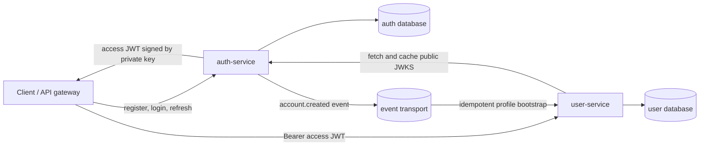

# План выделения `user-service` из `auth-service`

Статус: готовы этапы 1–4. В `user-service` реализованы remote JWKS verifier,
отдельная миграция/репозиторий и inbox consumer вместо lazy bootstrap, а
`GET/PATCH /api/users/me` защищены JWT; в
`auth-service` сущность и таблица переименованы в `AuthAccount`/`auth_accounts`,
регистрация пишет transactional outbox. Остаётся deployment-разделение этапа 5.

### Соглашение о сборке модулей

Подробные действующие правила и целевые переименования описаны в
[едином стандарте структуры сервисов](service-structure-standard.md).
Он уточняет этот план: HTTP-модули подключаются по образцу `auth.module.ts`,
контракты называются `*Port` и находятся в `ports/`, а `repo/` содержит SQL.

Файл, который собирает repository, use cases и HTTP routes feature-модуля,
называется явно: `auth.module.ts`, `session.module.ts`,
`user-profile.module.ts` или `integration-events.module.ts` и экспортирует
фабрику `create*Module`.

`index.ts` для composition root не используется: импорт каталога скрывает, что
создаётся runtime-модуль. `index.ts` допустим только как простой barrel без
логики, но текущим сервисам такие barrel-файлы не нужны. `container.ts` содержит
только общую runtime-инфраструктуру; feature-зависимости создаются внутри
соответствующего `*.module.ts`.

## Цель

Разделить два разных контекста:

- `auth-service` устанавливает личность клиента: регистрация учётной записи, логин,
  пароль, access/refresh-токены, сессии и запрет входа;
- `user-service` хранит и изменяет пользовательский профиль: имя, аватар, язык,
  часовой пояс и будущие бизнес-поля пользователя.

`user-service` принимает access JWT, выпущенный `auth-service`, и проверяет его
локально по публичному ключу. Приватный ключ остаётся только в `auth-service`.

## Главное решение о границе сервисов

Исходную таблицу `auth-service.users` нельзя было просто целиком перенести в
`user-service`: `auth-service` всё равно нужны email, хэш пароля и статус доступа
для логина. Если читать их по сети из `user-service`, логин начнёт зависеть от
другого сервиса, а `auth-service` перестанет быть владельцем credentials.

Поэтому текущий `User` в auth-коде следует переименовать в `AuthAccount` (или
`Identity`), а не считать его пользовательским профилем.

| Данные/операция | Владелец | Комментарий |
|---|---|---|
| `id` / JWT `sub` | `auth-service` | Канонический UUID учётной записи; тот же UUID используется как `user_profiles.user_id` |
| login email | `auth-service` | Нормализация, уникальность и поиск при логине остаются рядом с credentials |
| `password_hash` | `auth-service` | Никогда не передаётся в другие сервисы |
| `auth_status` (`active`, `blocked`) | `auth-service` | Определяет возможность логина и выпуска токенов |
| refresh-токены и сессии | `auth-service` | Только auth выпускает и отзывает токены |
| display name, avatar, locale, timezone | `user-service` | Редактируемый профиль |
| будущие профильные/бизнес-поля | `user-service` | Не добавлять их в auth-таблицу |

Не должно быть общей таблицы, cross-database JOIN или доступа одного сервиса под
DB-пользователем другого. Совпадение `auth_accounts.id` и
`user_profiles.user_id` — контракт, а не внешний ключ между БД.



## Целевая модель данных

### `auth-service`

До этапа 3 таблица `users` уже содержала только auth-данные. Её данные переносить
не потребовалось: граница закреплена миграцией с переименованием в БД и коде:

```sql
ALTER TABLE users RENAME TO auth_accounts;
ALTER TABLE auth_accounts RENAME COLUMN status TO auth_status;
ALTER INDEX users_email_key RENAME TO auth_accounts_email_key;
ALTER TABLE auth_accounts
  RENAME CONSTRAINT users_status_check TO auth_accounts_auth_status_check;
```

Итоговая ответственность таблиц:

```text
auth_accounts(id, email, password_hash, auth_status, created_at, updated_at)
sessions(id, user_id, ..., revoked_at, absolute_expires_at)
refresh_tokens(id, user_id, session_id, token_hash, ..., revoked_at)
```

FK из `sessions.user_id` и `refresh_tokens.user_id` после PostgreSQL rename
продолжат ссылаться на ту же таблицу. В коде следует последовательно переименовать:

- `User` -> `AuthAccount`;
- `UserRow` -> `AuthAccountRow`;
- `AuthRepository.findById` и `findByEmail` возвращают `AuthAccount`;
- сообщения вроде `User registered` можно оставить пользовательскими на внешнем
  API, но внутренние названия должны говорить об учётной записи.

Если переименование таблицы сейчас создаёт слишком большой diff, допустим
временный этап: оставить физическое имя `users`, но сразу переименовать доменную
сущность и запретить добавлять в эту таблицу профильные поля.

### `user-service`

Первая миграция сервиса:

```sql
CREATE TABLE user_profiles (
  user_id      uuid        PRIMARY KEY,
  display_name text,
  avatar_url    text,
  locale        text,
  timezone      text,
  created_at    timestamptz NOT NULL DEFAULT now(),
  updated_at    timestamptz NOT NULL DEFAULT now()
);
```

Рекомендации:

- не копировать сюда `password_hash`, refresh-токены или сессии;
- не делать login email редактируемым профильным полем. Если UI должен показать
  email, получать auth-account и профиль отдельными запросами либо объединять их
  в API gateway/BFF;
- не дублировать поле `status` без уточнения смысла. `auth_status` запрещает вход,
  а возможный будущий `profile_visibility` решает другую задачу;
- `user_id` не принимать из body в операциях `/me`: брать только из проверенного
  JWT `sub`.

В production у сервисов должны быть отдельные logical database и DB credentials.
Они могут сначала жить на одном PostgreSQL-инстансе, но runtime-доступ должен быть
разделён:

```text
auth-service -> auth database only
user-service -> users database only
```

## API первого релиза `user-service`

Минимальный API лучше ограничить текущим пользователем:

| Метод | Путь | Auth | Назначение |
|---|---|---|---|
| `GET` | `/health/check` | — | liveness |
| `GET` | `/health/ready` | — | readiness БД; доступность auth не проверять на каждый probe |
| `GET` | `/api/users/me` | Bearer JWT | Получить свой профиль |
| `PATCH` | `/api/users/me` | Bearer JWT | Частично изменить свой профиль |

Пример ответа:

```json
{
  "data": {
    "id": "550e8400-e29b-41d4-a716-446655440000",
    "displayName": "Arsen",
    "avatarUrl": null,
    "locale": "ru",
    "timezone": "Asia/Qyzylorda",
    "createdAt": "2026-09-07T10:00:00Z",
    "updatedAt": "2026-09-07T10:00:00Z"
  }
}
```

На `PATCH /me` разрешается менять только явный allow-list полей. `userId`, даты и
любые будущие служебные флаги из body игнорировать нельзя — такой body должен
получать `422`.

Публичный `GET /api/users/:id`, поиск пользователей и admin API не входят в
первый этап: для них сначала нужны правила видимости и отдельная авторизация.

`GET /api/auth/me`, если он понадобится, остаётся в `auth-service` и возвращает
только сведения об учётной записи (например, email и `authStatus`), а не профиль.

## Как `user-service` использует JWT

### Распределение ключей

В текущем коде `auth-service` подписывает ES256-токен приватным ключом и публикует
публичный JWK на `GET /.well-known/jwks.json`. Это правильная основа.

Правила:

1. `JWT_PRIVATE_KEY` существует только в secret-хранилище и окружении
   `auth-service`.
2. `user-service` не содержит `JwtSigner`, генератор refresh-токенов, password
   hasher, `JWT_PRIVATE_KEY` или `JWT_EXPIRES_IN`.
3. `user-service` получает публичные ключи по фиксированному
   `AUTH_JWKS_URL`, кэширует их и выбирает ключ по JWT header `kid`.
4. Публичный ключ не является секретом, но JWKS endpoint должен быть доверенным:
   фиксированный URL, HTTPS вне доверенной внутренней сети и запрет подмены URL
   данными запроса.

В скопированном каркасе `services/user-service` сейчас присутствуют
`jwt-signer.ts`, `JWT_PRIVATE_KEY`, password hasher и refresh-token generator.
Перед реализацией домена их нужно удалить: это auth-возможности, которые
`user-service` иметь не должен.

### Конфигурация consumer-а

Вместо скопированных `JWT_*` нужны только параметры проверки:

```dotenv
AUTH_JWKS_URL=http://auth-service:3000/.well-known/jwks.json
AUTH_JWT_ISSUER=auth-service
AUTH_JWT_AUDIENCE=api
AUTH_JWKS_TIMEOUT_MS=3000
AUTH_JWT_CLOCK_TOLERANCE_SEC=5
```

`AUTH_JWT_AUDIENCE=api` сохраняет совместимость с текущими токенами. Когда появятся
разные классы токенов, безопаснее перейти на service-specific audience
`user-service`; тогда `auth-service` должен явно выпускать такой `aud`, а миграция
делается с периодом принятия старого и нового audience.

### Проверка токена

Рекомендуемый verifier использует remote JWKS из `jose`, а не статическую копию
PEM в каждом сервисе:

```ts
import { createRemoteJWKSet, jwtVerify } from 'jose'

const jwks = createRemoteJWKSet(new URL(env.AUTH_JWKS_URL), {
  timeoutDuration: env.AUTH_JWKS_TIMEOUT_MS,
})

const verifyAccessToken = async (token: string) => {
  const { payload } = await jwtVerify(token, jwks, {
    algorithms: ['ES256'],
    issuer: env.AUTH_JWT_ISSUER,
    audience: env.AUTH_JWT_AUDIENCE,
    typ: 'JWT',
    requiredClaims: ['iss', 'aud', 'sub', 'sid', 'iat', 'exp'],
    clockTolerance: env.AUTH_JWT_CLOCK_TOLERANCE_SEC,
  })

  // После криптографической проверки отдельно валидировать runtime-схемой:
  // sub и sid — UUID; iat/exp — integer; exp > iat; лишние claims — по контракту.
  return { userId: payload.sub as string, sessionId: payload.sid as string }
}
```

Guard выполняет следующий алгоритм:

1. Разобрать ровно `Authorization: Bearer <token>`.
2. Проверить подпись по JWK, указанному в `kid`.
3. Разрешить только `alg=ES256` и `typ=JWT`.
4. Проверить `iss`, `aud`, `exp`, `iat`, обязательные `sub` и `sid`.
5. Проверить runtime-схему payload; `sub` и `sid` должны быть UUID.
6. Положить в scoped context только `{ userId: sub, sessionId: sid }`.
7. Для отсутствующего, испорченного или истёкшего токена вернуть одинаковый
   `401 UNAUTHORIZED`, не отдавая клиенту криптографические подробности.

`sub` отвечает на вопрос «кто делает запрос», а `sid` — «из какой auth-сессии».
Поля профиля нельзя брать из неподписанных заголовков или request body.

Проверка выполняется локально: после прогрева JWKS `user-service` не вызывает
`auth-service` на каждый запрос. При неизвестном `kid` библиотека обновляет JWKS;
если auth/JWKS временно недоступен, уже закэшированные ключи продолжают работать.
После успешного обновления отсутствие запрошенного `kid` означает невалидный
токен и даёт `401`. Сетевой сбой при обязательном обновлении JWKS — инфраструктурная
ошибка: проверка закрывается (запрос не пропускается), наружу возвращается `503`,
а причина пишется в метрики и логи без записи самого токена.

### Отзыв сессии и срок действия access-токена

JWT stateless. Logout или блокировка учётной записи не делают уже выпущенный
access-токен мгновенно недействительным в `user-service`: он будет приниматься до
`exp` (сейчас около 15 минут). Для первого релиза это принимаемый компромисс:

- access JWT короткоживущий;
- refresh и выпуск новых JWT прекращает `auth-service`;
- чувствительные операции при необходимости получают отдельную online-проверку
  сессии или deny-list по `sid`.

Не следует добавлять запрос в auth на каждый обычный профильный запрос только
ради мгновенного logout — это уничтожит преимущества локальной JWT-проверки.

### Ротация ключей

Текущий JWKS отдаёт один ключ. До первой ротации endpoint надо научить публиковать
массив активного и предыдущих публичных ключей:

1. Сгенерировать новую пару и новый уникальный `kid`.
2. Опубликовать новый public JWK рядом со старым, пока подписывать старым ключом.
3. Дождаться окна обновления JWKS-кэшей consumer-ов.
4. Переключить подпись на новый private key/`kid`.
5. Держать старый public JWK как минимум до истечения последнего подписанного им
   access JWT плюс clock tolerance.
6. Затем убрать старый public JWK и удалить старый private key по принятой secret
   retention policy.

Private key никогда не публикуется и не копируется в `user-service` даже на время
ротации.

## Создание профиля и согласованность

Внешняя регистрация остаётся `POST /api/auth/register`, потому что её обязательные
данные — login email и пароль. Auth создаёт UUID учётной записи. Профиль с тем же
UUID создаётся асинхронно.

Целевой вариант — transactional outbox:

1. В той же DB-транзакции, где создаётся `auth_accounts`, записать outbox event.
2. Publisher доставляет событие через выбранный transport.
3. `user-service` принимает событие и идемпотентно создаёт пустой профиль.
4. Inbox/таблица обработанных `eventId` защищает от повторной доставки.

Минимальный контракт события:

```json
{
  "eventId": "4c203a1c-d810-47ba-9e44-7d881a526ee2",
  "type": "auth.account-created.v1",
  "occurredAt": "2026-09-07T10:00:00Z",
  "data": {
    "userId": "550e8400-e29b-41d4-a716-446655440000"
  }
}
```

Email и password hash в событие не включать: для создания пустого профиля они не
нужны. Consumer делает `INSERT ... ON CONFLICT (user_id) DO NOTHING`.

Так как transport/broker в репозитории пока отсутствует, допустимый переходный
MVP — lazy bootstrap: первый валидный `GET /api/users/me` создаёт пустой профиль
по JWT `sub`, если строки ещё нет. Это устраняет синхронный вызов auth -> users и
гонку «регистрация завершилась, событие ещё не обработано». После внедрения
outbox и успешной сверки данных lazy bootstrap нужно убрать, иначе удалённый
профиль может случайно создаться заново.

Не использовать «вставили account, затем синхронно вызвали user-service» как
единственный механизм: падение второго запроса оставит систему в частично
записанном состоянии, а общей транзакции между БД нет.

## Миграция существующих данных

Сейчас в auth-таблице нет профильных полей, поэтому переносить PII между таблицами
не требуется. Для чистого развёртывания backfill не нужен: все новые accounts
сразу получают outbox event.

Если перед rollout уже существуют ценные `auth_accounts`, для них нужно один раз
создать пустые профили. Это deployment-задача, а не возможность runtime-сервиса.
До появления реального production dataset отдельный backfill-скрипт в репозитории
не хранится.

При необходимости одноразовая job должна:

1. читает UUID из auth database страницами;
2. пишет их в users database через отдельное подключение;
3. использует `ON CONFLICT DO NOTHING`, поэтому безопасен для повторного запуска;
4. сверяет `count(auth_accounts)` и количество созданных/преднамеренно удалённых
   профилей;
5. после backfill повторно проигрывает outbox-события, появившиеся во время
   миграции.

Это единственное место, где процесс временно получает read credentials auth DB и
write credentials users DB. Оба секрета выдаются job, а не runtime-контейнерам.

## Порядок реализации

### Этап 1. Очистить каркас `user-service`

- удалить `jwt-signer.ts`, password hasher, refresh-token generator и связанные
  env-переменные/скрипты;
- добавить зависимость `jose` и consumer-only remote JWKS verifier;
- оставить общие HTTP errors, logging, health и OpenAPI;
- дать сервису собственный `DATABASE_URL` и порт, например `3001`.

Результат: `user-service` физически не способен подписывать токены или проверять
пароли.

### Этап 2. Реализовать профильный домен

- собственные migrations и `user_profiles`;
- `UserProfileRepository`;
- use cases `getMyProfile` и `updateMyProfile`;
- `/api/users/me` под JWT guard;
- строгие request/response schemas и единый error envelope.

На этом этапе использовать lazy bootstrap, если event transport ещё не выбран.

### Этап 3. Закрепить auth-границу

Статус: выполнен миграцией `0006_rename_users_to_auth_accounts.sql` и
рефакторингом auth-модуля.

- переименовать auth entity `User` в `AuthAccount`;
- переименовать таблицу `users` в `auth_accounts` отдельной миграцией либо явно
  отложить только физический rename;
- убедиться, что sessions и refresh tokens остаются в auth DB;
- не добавлять профильные endpoints в `auth-service`.

### Этап 4. Добавить синхронизацию жизненного цикла

Статус: выполнен. Пока в репозитории нет брокера, transport реализован как
защищённая internal HTTP-доставка поверх PostgreSQL outbox с at-least-once
семантикой. Inbox user-service делает повтор события успешным no-op.

- transactional outbox в `auth-service`;
- событие `auth.account-created.v1`;
- idempotent consumer/inbox в `user-service`;
- отдельный backfill только при наличии существующих production accounts;
- метрики задержки и dead-letter/retry policy;
- после подтверждённой доставки убрать lazy bootstrap.

Реализация также предоставляет `/metrics` с pending/DLQ, возрастом старейшего
события, длительностью запросов и временем до успешной доставки. Worker
использует lease с идентификатором владельца + `SKIP LOCKED`, экспоненциальные
повторы с jitter и переводит событие в DLQ после настроенного лимита.
Для чистого развёртывания backfill отсутствует как ненужная постоянная
инфраструктура. Если перед rollout обнаружатся существующие accounts без
профилей, одноразовая job проектируется под фактический объём и окружение.

#### Структура `integration-events`

Модуль назван по стабильной границе — событиям между сервисами, а не по первому
сценарию `account-created`. Поэтому сюда без переименования модуля смогут войти
будущие `account-blocked.v1` и `account-deleted.v1`.

В `auth-service`:

| Файл | Ответственность |
|---|---|
| `auth/events/create-account-created.event.ts` | Создание доменного события |
| `integration-events/outgoing/repo/*` | Port outbox и PostgreSQL lease/state implementation |
| `integration-events/outgoing/deliver-pending-events.ts` | Один цикл retry/DLQ и фиксации результата |
| `integration-events/outgoing/outbox.worker.ts` | Таймер, start/stop и graceful shutdown |
| `integration-events/outgoing/http/send-event.http.ts` | Один HTTP-запрос к consumer |
| `integration-events/outgoing/metrics/delivery.metrics.ts` | Технические измерения доставки |
| `integration-events.module.ts` | Сборка исходящей доставки |

В `user-service`:

| Файл | Ответственность |
|---|---|
| `integration-events/incoming/repo/*` | Port inbox и PostgreSQL implementation |
| `integration-events/incoming/receive-integration-event.ts` | Общая транзакция inbox + handler |
| `integration-events/incoming/handler-registry.ts` | Типизированный выбор обработчика |
| `integration-events/incoming/http/integration-events.routes.ts` | Credentials, schema и HTTP-ответ |
| `user-profile/events/on-account-created.ts` | Реакция профильного домена на событие |
| `integration-events.module.ts` | Сборка входящей обработки |

Runtime-схема и TypeScript-тип находятся в версионируемом пакете
`packages/integration-event-contracts`. Сервисы импортируют контракт, но не код
друг друга. Закрытая schema означает, что любое изменение payload выпускается
новой версией: consumer начинает принимать её раньше producer-а.

Удаление account проектируется отдельно: auth сначала отзывает все сессии и
публикует versioned event, после чего users удаляет или анонимизирует профиль.
До определения retention policy endpoint удаления лучше не добавлять.

### Этап 5. Deployment

- добавить отдельную users database/роль и migration container в Compose;
- добавить `user-service` на порту `3001`;
- передать ему только `AUTH_JWKS_URL`, issuer, audience и internal consumer token;
- передать auth-service только URL consumer-а и парный delivery token, без доступа
  к users DB;
- настроить service DNS/network policy: users может читать auth JWKS, auth не
  получает доступ к users DB;
- разделить readiness: отсутствие соединения с собственной БД делает users
  unready, временная недоступность JWKS учитывается отдельно из-за локального
  кэша.

## Проверки перед rollout

### Unit/contract tests

- валидный JWT из `auth-service` принимается и даёт правильные `userId`/`sid`;
- wrong signature, `alg`, `kid`, `iss`, `aud`, `typ`, истёкший `exp`, отсутствующий
  `sub`/`sid` и не-UUID claims дают `401`;
- JWT, подписанный private key текущего auth, проходит verifier user-service;
- JWKS с old + new key работает во время ротации;
- `PATCH /me` не позволяет менять чужой `userId`;
- повтор одного account-created event не создаёт дубль.

### Integration/E2E

1. Зарегистрировать account.
2. Выполнить login и получить access JWT.
3. Вызвать `GET /api/users/me` с JWT и получить профиль с `id === sub`.
4. Изменить профиль через `PATCH /me` и прочитать изменения.
5. Проверить, что запрос без токена и с токеном другого issuer отклоняется.
6. Проверить работу при временно выключенном auth с уже прогретым JWKS-кэшем.
7. Проверить ожидаемое окно после logout: старый access JWT живёт только до
   своего `exp`, refresh уже не работает.

## Критерии готовности

- `auth-service` владеет только account/credentials/sessions и единственным JWT
  private key;
- `user-service` владеет собственной БД профилей и не имеет auth DB credentials;
- один и тот же UUID используется как auth `id`, JWT `sub` и profile `user_id`;
- `/api/users/me` использует только проверенный `sub`, а не ID от клиента;
- JWT проверяется локально через кэшируемый JWKS с фиксированными `alg`, `iss`,
  `aud`, `typ` и runtime-схемой claims;
- регистрация создаёт профиль с гарантированной повторной доставкой либо временно
  покрыта явно обозначенным lazy bootstrap;
- задокументирована и протестирована ротация ключей;
- ни private key, ни password hash, ни refresh token не покидают `auth-service`.

## Что сознательно не входит в первый релиз

- роли и permissions в JWT;
- мгновенная распределённая ревокация access JWT;
- публичный каталог/поиск пользователей;
- admin API и блокировка профиля;
- распределённая транзакция между сервисами;
- перенос login email в `user-service`.

Эти задачи можно добавлять независимо после того, как границы владения данными и
JWT-контракт закреплены тестами.
